[](https://classroom.github.com/open-in-codespaces?assignment_repo_id=13952736)
# Proyecto - Algoritmos de Ordenamiento

Los algoritmos de ordenamiento son una serie de instrucciones que toman una matriz o lista como entrada y la reorganizan en un orden específico. Los órdenes más comunes son numéricos (ascendente, descendente) o lexicográficos.

Existen varios algoritmos de ordenamiento, cada uno con sus propias ventajas y desventajas. Aquí se presentan algunos de los más comunes:

## 1. Insertion Sort (Ordenamiento por Inserción)
Insertion Sort es un algoritmo de ordenamiento que ordena una lista de elementos uno a la vez. Se asemeja a la forma en que las personas ordenan las cartas en un juego de póker.

El algoritmo divide la lista en dos partes: la parte ordenada y la parte desordenada. Inicialmente, la parte ordenada contiene un solo elemento (por lo tanto, está ordenada). Luego, en cada iteración, se retira un elemento de la parte desordenada y se encuentra su posición dentro de la parte ordenada y se inserta allí. Se repite hasta que no queden más elementos en la parte desordenada.

El algoritmo es eficiente para listas que ya están parcialmente ordenadas: en el mejor caso, cuando la entrada está ordenada, cada inserción requiere comprobar solo un elemento. En el peor de los casos, cuando la entrada está ordenada en orden inverso, cada inserción requiere comprobar todos los elementos ya ordenados.

Aunque Insertion Sort no es tan rápido como otros algoritmos de ordenamiento más sofisticados para listas grandes, tiene varias ventajas: es fácil de entender e implementar, es eficiente para listas pequeñas, es eficiente para listas que ya están parcialmente ordenadas y es estable (mantiene el orden relativo de elementos iguales).

**COMPLEJIDAD ALGORITMICA:** 


   Complejidad de Tiempo: 


      peor caso:O(n^2) cuando el arreglo esta ordenado en forma inversa
      mejor caso: O(n) cuando el arreglo ya esta ordenado


   Complejidad de Espacio:


       O(1) Ordenamiento in situ

## 2. Selection Sort (Ordenamiento por Selección)
Selection Sort es un algoritmo de ordenamiento que selecciona el elemento más pequeño (o más grande, dependiendo del orden de clasificación) de la lista desordenada y lo intercambia con el primer elemento no ordenado, moviéndolo a la parte ordenada de la lista. Este proceso se repite para cada elemento no ordenado hasta que toda la lista esté ordenada.

El algoritmo divide la lista en dos partes: la parte ordenada y la parte desordenada. Inicialmente, la parte ordenada está vacía y la parte desordenada contiene todos los elementos. En cada iteración, se selecciona el elemento más pequeño (o más grande) de la parte desordenada y se intercambia con el primer elemento no ordenado, moviéndolo a la parte ordenada.

Aunque Selection Sort es fácil de entender e implementar, no es un algoritmo eficiente para listas grandes. Tiene una complejidad de tiempo de O(n^2) en todos los casos, lo que significa que el tiempo de ejecución aumenta cuadráticamente con el tamaño de la lista. Sin embargo, tiene la ventaja de minimizar el número de intercambios: en el peor de los casos, se realizarán n intercambios, lo que puede ser útil en ciertos escenarios donde el costo de intercambio es alto.

**COMPLEJIDAD ALGORITMICA:** 


   Complejidad de Tiempo:


      peor caso :    O(n^2) 
      mejor caso:    O(n^2) 
      caso promedio: O(n^2) 
   Complejidad de Espacio:


       O(1) Ordenamiento in situ

## 3. Bubble Sort (Ordenamiento de burbuja)

Bubble Sort es un algoritmo de ordenamiento simple que compara repetidamente pares de elementos adyacentes en la lista y los intercambia si están en el orden incorrecto. Este proceso se repite desde el principio de la lista hasta que no se necesiten más intercambios, lo que indica que la lista está ordenada.

El algoritmo recibe su nombre porque los elementos más grandes "burbujean" hasta el final de la lista. En cada iteración a través de la lista, el algoritmo compara cada par de elementos adyacentes y los intercambia si están en el orden incorrecto. Esto mueve el elemento más grande de los dos hacia el final de la lista. Después de una iteración, el elemento más grande estará en la última posición de la lista. Luego, el algoritmo repite el proceso para el resto de la lista, y así sucesivamente, hasta que toda la lista esté ordenada.

Aunque Bubble Sort es fácil de entender e implementar, no es un algoritmo eficiente para listas grandes. Tiene una complejidad de tiempo de O(n^2) en el peor y en el caso promedio, lo que significa que el tiempo de ejecución aumenta cuadráticamente con el tamaño de la lista. Sin embargo, en el mejor de los casos, cuando la entrada ya está ordenada, Bubble Sort tiene una complejidad de tiempo de O(n). Además, es un algoritmo de ordenamiento estable, lo que significa que mantiene el orden relativo de elementos iguales.

**COMPLEJIDAD ALGORITMICA:**


   Complejidad de Tiempo: 


      peor caso :    O(n^2) 
      mejor caso:    O(n) Cuando el arreglo ya esta ordenado
      caso promedio: O(n^2) 


   Complejidad de Espacio:


       O(1) Ordenamiento in situ

## 4. Quick Sort (Ordenamiento rápido)

Quick Sort es un algoritmo de ordenamiento eficiente que utiliza la estrategia de divide y vencerás. Selecciona un elemento llamado 'pivote' y organiza todos los elementos menores que el pivote a su izquierda y todos los elementos mayores a su derecha. Luego, realiza la misma operación de forma recursiva en los subconjuntos de elementos a la izquierda y a la derecha del pivote.

El proceso de organizar los elementos con respecto al pivote se llama particionado. Hay varias estrategias para seleccionar el pivote; una opción común es usar el primer elemento, el último elemento o un elemento aleatorio.

Quick Sort es un algoritmo en el lugar, lo que significa que no necesita espacio adicional significativo para realizar la ordenación. En el caso promedio y en el mejor de los casos, Quick Sort tiene una complejidad de tiempo de O(n log n). Sin embargo, en el peor de los casos, cuando la entrada está ordenada o casi ordenada, Quick Sort tiene una complejidad de tiempo de O(n^2), aunque este comportamiento puede evitarse con una buena elección del pivote.

Aunque Quick Sort es más difícil de entender e implementar que algunos algoritmos de ordenamiento simples, es mucho más eficiente para listas grandes y es uno de los algoritmos de ordenamiento más utilizados en la práctica.

**COMPLEJIDAD ALGORITMICA:**


   Complejidad de Tiempo: 


      peor caso :    O(n^2) Cuando esta ordenado en orden inverso o en orden y el
                            privote es el elemento mas pequeño o mas grande
      mejor caso:    O(n log n) Cuando el arreglo ya esta ordenado
      caso promedio: O(n long n) 


   Complejidad de Espacio:


       O(log n) Utiliza recursividad y necesita almacenar información en la pila de llamadas
                también hay versiones que son in situ

## 5. Shell Sort
Shell Sort es un algoritmo de ordenamiento que generaliza el ordenamiento por inserción permitiendo comparaciones y movimientos de elementos que están separados por una cierta distancia. En lugar de comparar solo elementos adyacentes (como en el ordenamiento por inserción), Shell Sort compara elementos que están a una cierta 'distancia' de distancia, donde la 'distancia' se reduce en cada iteración del algoritmo.

El proceso comienza con una 'distancia' grande (a menudo la longitud de la lista dividida por 2), y en cada iteración, la 'distancia' se reduce (a menudo se divide por 2), hasta que llega a 1. Cuando la 'distancia' es 1, Shell Sort se convierte en ordenamiento por inserción, pero para entonces, la lista ya está casi ordenada, lo que hace que el ordenamiento por inserción sea eficiente.

Shell Sort es más eficiente que el ordenamiento por inserción para listas grandes, ya que los elementos se mueven hacia su posición final en la lista más rápidamente. Sin embargo, la eficiencia de Shell Sort depende de la elección de las 'distancias'. Aunque Shell Sort es más difícil de entender e implementar que algunos algoritmos de ordenamiento simples, es bastante eficiente para listas medianas y grandes.

**COMPLEJIDAD ALGORITMICA:**


   Complejidad de Tiempo: 
      peor caso :    O(n^2) Cuando esta ordenado en orden inverso o en orden y el
                            privote es el elemento mas pequeño o mas grande
      caso promedio: O(n long n) 


   Complejidad de Espacio:


       O(1) Ordenamiento in situ

## 6. Radix Sort
Radix Sort es un algoritmo de ordenamiento no comparativo que clasifica los datos con números enteros claves por grupos de dígitos individuales que comparten la misma posición y valor significativo. El ordenamiento se realiza de manera que los dígitos se ordenan del menos significativo al más significativo (LSD Radix Sort) o del más significativo al menos significativo (MSD Radix Sort).

En cada paso, se recogen todos los elementos en 'cubos' según el dígito en la posición actual, luego se recogen de nuevo en la lista. Este proceso se repite para cada posición de dígito.

Radix Sort tiene una complejidad de tiempo de O(nk), donde n es el número de elementos y k es el número de dígitos en el número más grande. Esto lo hace muy eficiente para listas grandes donde los números de dígitos de los elementos no son muy grandes.

Es importante mencionar que Radix Sort solo funciona con datos numéricos. No puede usarse para ordenar datos que no se pueden representar como números, como cadenas de texto (a menos que se puedan convertir de alguna manera en números).

**COMPLEJIDAD ALGORITMICA:**


   Complejidad de Tiempo: 
      peor caso :    O(nk) n número de elementos y k número de dígitos del número mas grande
      mejor caso:    O(nk) n número de elementos y k número de dígitos del número mas grande
      caso promedio: O(nk) n número de elementos y k número de dígitos del número mas grande 


   Complejidad de Espacio:
       O(n+k) n número de elementos y k número de cubos(10 para decimales), requiere espacio adicional


## 7. Merge Sort (Ordenamiento por mezcla)

Merge Sort es un algoritmo de ordenamiento por división. Primero divide la lista en la mitad, ordena las dos mitades y luego las mezcla en una sola lista ordenada.

El proceso de dividir la lista se realiza de manera recursiva, dividiendo la lista hasta que solo queden subconjuntos de un elemento, que ya están ordenados. Luego, estos subconjuntos se mezclan de nuevo en listas más grandes, manteniendo el orden de los elementos. Este proceso de mezcla se repite hasta que todos los subconjuntos se han mezclado en una sola lista ordenada.

Merge Sort tiene una complejidad de tiempo de O(n log n) en todos los casos, lo que lo hace eficiente para listas grandes. Sin embargo, requiere espacio adicional para la lista ordenada, lo que puede ser una desventaja si el espacio de memoria es limitado.

Aunque Merge Sort es más difícil de entender e implementar que algunos algoritmos de ordenamiento simples, es mucho más eficiente para listas grandes y es uno de los algoritmos de ordenamiento más utilizados en la práctica.

**COMPLEJIDAD ALGORITMICA:**


   Complejidad de Tiempo: 


      peor caso :    O(log n) n número de elementos 
      mejor caso:    O(log n) n número de elementos 
      caso promedio: O(log n) n número de elementos 


   Complejidad de Espacio:


       O(n) n número de elementos, requiere espacio adicional

## 8. Mezcla Directa
La Mezcla Directa es una variante del algoritmo de ordenamiento Merge Sort. Al igual que Merge Sort, Mezcla Directa es un algoritmo de ordenamiento por división que divide la lista en dos mitades, ordena las dos mitades y luego las mezcla en una sola lista ordenada.

La diferencia clave entre Merge Sort y Mezcla Directa es la forma en que se dividen y se mezclan las listas. En Mezcla Directa, la lista se divide en dos mitades iguales (o casi iguales si la lista tiene un número impar de elementos). Luego, cada mitad se ordena de forma recursiva utilizando Mezcla Directa, y finalmente las dos mitades ordenadas se mezclan en una sola lista ordenada.

La mezcla de las dos listas ordenadas se realiza de manera que se mantiene el orden de los elementos. Se toma el primer elemento de cada lista, se comparan, y el más pequeño se agrega a la lista ordenada. Este proceso se repite hasta que todos los elementos de ambas listas se han agregado a la lista ordenada.

Mezcla Directa tiene una complejidad de tiempo de O(n log n) en todos los casos, lo que lo hace eficiente para listas grandes. Sin embargo, requiere espacio adicional para la lista ordenada, lo que puede ser una desventaja si el espacio de memoria es limitado.

**COMPLEJIDAD ALGORITMICA:**


   Complejidad de Tiempo: 


      peor caso :    O(log n) n número de elementos 
      mejor caso:    O(log n) n número de elementos 
      caso promedio: O(log n) n número de elementos 


   Complejidad de Espacio:


       O(n) n número de elementos, requiere espacio adicional


## 9. Natural Sort (Mezcla Natural)
La Mezcla Natural es una variante del algoritmo de ordenamiento Merge Sort. Al igual que Merge Sort, Mezcla Natural es un algoritmo de ordenamiento por división que divide la lista en subconjuntos, los ordena y luego los mezcla en una sola lista ordenada.

La diferencia entre Merge Sort y Mezcla Natural radica en cómo se dividen y se mezclan las listas. En Mezcla Natural, la lista se divide en subconjuntos donde cada subconjunto es una secuencia de elementos ya ordenados (una "secuencia natural"). Cada secuencia natural se ordena de forma independiente, y luego todas las secuencias ordenadas se mezclan en una sola lista ordenada.

La mezcla de las secuencias ordenadas se realiza de manera que se mantiene el orden de los elementos. Se toma el primer elemento de cada secuencia, se comparan, y el más pequeño se agrega a la lista ordenada. Este proceso se repite hasta que todos los elementos de todas las secuencias se han agregado a la lista ordenada.

Mezcla Natural tiene una complejidad de tiempo de O(n log n) en el peor de los casos, lo que lo hace eficiente para listas grandes. Sin embargo, en el mejor de los casos, cuando la entrada ya está ordenada, Mezcla Natural tiene una complejidad de tiempo de O(n). Al igual que Merge Sort, Mezcla Natural requiere espacio adicional para la lista ordenada, lo que puede ser una desventaja si el espacio de memoria es limitado.

**COMPLEJIDAD ALGORITMICA:**


   Complejidad de Tiempo: 


      peor caso :    O(log n) n número de elementos 
      mejor caso:    O(log n) n número de elementos 
      caso promedio: O(log n) n número de elementos 


   Complejidad de Espacio:

   
       O(n) n número de elementos, requiere espacio adicional


## 10. Heap Sort (Ordenamiento por montículo)

Heap Sort es un algoritmo de ordenamiento que utiliza la estructura de datos del montículo para ordenar la lista. Un montículo es un árbol binario completo (o casi completo) que satisface la propiedad del montículo: cada nodo es mayor (o menor, en el caso de un montículo mínimo) que todos sus descendientes.

El algoritmo Heap Sort funciona de la siguiente manera:

Primero transforma la lista en un montículo máximo. Esto se puede hacer de manera eficiente en tiempo O(n).

Luego, intercambia repetidamente el elemento máximo del montículo (que es la raíz del montículo) con el último elemento no ordenado de la lista. Esto coloca el elemento máximo en su posición correcta en la lista ordenada.

Después de cada intercambio, el tamaño del montículo se reduce en uno (el elemento intercambiado ya está en su posición correcta y no se considera parte del montículo), y el elemento que se intercambió en la raíz del montículo puede violar la propiedad del montículo. Por lo tanto, se "flota hacia abajo" en el montículo, intercambiándolo con uno de sus hijos hasta que la propiedad del montículo se restaure. Esto se puede hacer en tiempo O(log n).

Este proceso se repite hasta que el montículo esté vacío y todos los elementos estén en su posición correcta.

Heap Sort tiene una complejidad de tiempo de O(n log n) en todos los casos, lo que lo hace eficiente para listas grandes. Además, es un algoritmo en el lugar, lo que significa que no necesita espacio adicional significativo para realizar la ordenación.

**COMPLEJIDAD ALGORITMICA:**


   Complejidad de Tiempo: 


      peor caso :    O(log n) n número de elementos 
      mejor caso:    O(log n) n número de elementos 
      caso promedio: O(log n) n número de elementos 


   Complejidad de Espacio:


       O(1) in situ por lo que NO requiere espacio adicional


## Descripción del Problema

Este proyecto se centra en la implementación y comparación de diferentes métodos de ordenamiento. Los algoritmos de ordenamiento son fundamentales para la ciencia de la computación y se utilizan en una amplia variedad de aplicaciones. En este proyecto, implementamos varios algoritmos de ordenamiento, incluyendo Heap Sort, Merge Sort, Mezcla Directa, Mezcla Natural y Radix Sort.

Cada uno de estos algoritmos tiene sus propias ventajas y desventajas en términos de eficiencia, uso de memoria y facilidad de implementación. Al implementar estos algoritmos, podemos obtener una comprensión más profunda de cómo funcionan y cuándo es mejor usar cada uno.

Además de implementar estos algoritmos, también proporcionamos un diagrama de clases para ayudar a visualizar la estructura del proyecto. Este diagrama se puede ver utilizando el enlace al editor en línea proporcionado.

El objetivo final de este proyecto es proporcionar una referencia útil para estos algoritmos de ordenamiento y ayudar a otros a aprender más sobre ellos.


**Este ejercicio implementa diferentes métodos de ordenamiento**


## Diagrama de clases
[Editor en línea](https://mermaid.live/)

```mermaid
---
title: TAD Arbol Binario
---
classDiagram
       class Principal{
        -Scanner consola
        -int opc
        -final int n
        -OrdUtil entero
        -OrdUtil contacto
        -OrdInsercion oEnteroIns
        -OrdInsercion oContactoIns
        -OrdSeleccion oEnteroSel
        -OrdSeleccion oContactoSel
        -OrdBurbuja oEnteroBur
        -OrdBurbuja oContactoBur
        -OrdQuickSort oEnteroQui
        -OrdQuickSort oContactoQui
        -OrdShellSort oEnteroShe
        -OrdShellSort oContactoShe
        -OrdRadixSort oEnteroRad
        -OrdMergeSort oEnteroMer
        -OrdMergeSort oContactoMer
        -OrdNaturalMerge oEnteroNat
        -OrdNaturalMerge oContactoNat
        -OrdHeapSort oEnteroHeap
        -OrdHeapSort oContactoHeap
        +void main(String[] args)
    }
    class OrdUtil{
        +Comparable[] generarArray(Class type, int n)
        +static Integer generateRandomInteger()
        +static Contacto generateRandomContacto()
        +void imprimirArray(Comparable[] arreglo)
    }
    class OrdInsercion{
        int i
        -int j
        -Comparable aux
        +Comparable[] ordenar(Comparable[] a)
    }
    class OrdSeleccion{
         -int indiceMenor
        -int i
        -int j
        -int n
        +Comparable[] ordenar(Comparable[] a)
        -void intercambiar(Comparable[] a, int i, int j)
    }
    class OrdBurbuja{
        +Comparable[] ordenar(Comparable[] array)
        -void intercambiar(Comparable[] array, int a, int b)
    }
    class OrdQuickSort{
        +Comparable[] ordenar(Comparable[] array)
        -void quickSort(Comparable[] array, int izq, int der)
    }
    class OrdShellSort{
         +Comparable[] ordenar(Comparable[] arreglo)
    }
    class OrdRadixSort{
        +Integer[] ordenar(Integer[] arreglo)
        -int obtenerMaximo(Integer[] arreglo)
        -void ordenarPorCuenta(Integer[] arreglo, int exp)
    }
    class OrdMergeSort{
       +Comparable[] ordenar(Comparable[] ArregloA, Comparable[] ArregloB)
    }
    class OrdNaturalMerge{
        +Comparable[] mezclaNatural(Comparable[] array)
        +Comparable[] mezclaDirecta(Comparable[] array)
    }
    class OrdHeapSort{
        +Comparable[] ordenar(Comparable[] arreglo)
        -void convertirEnHeap(Comparable[] arreglo, int tamaño, int i)
    }
    class Contacto{
        -String nombres
        -String apellidos
        -String direccion
        -String correo
        -String telefono
        -String celular
        +Contacto(String nombres, String apellidos, String direccion, String correo, String telefono, String celular)
        +String getNombres()
        +void setNombres(String nombres)
        +String getApellidos()
        +void setApellidos(String apellidos)
        +String getDireccion()
        +void setDireccion(String direccion)
        +String getCorreo()
        +void setCorreo(String correo)
        +String getTelefono()
        +void setTelefono(String telefono)
        +String getCelular()
        +void setCelular(String celular)
        +String toString()
        +int compareTo(Contacto o)
    }
    Principal --> OrdUtil
    Principal --> OrdInsercion
    Principal --> OrdSeleccion
    Principal --> OrdBurbuja
    Principal --> OrdQuickSort
    Principal --> OrdShellSort
    Principal --> OrdRadixSort
    Principal --> OrdMergeSort
    Principal --> OrdNaturalMerge
    Principal --> OrdHeapSort
    Principal --> Contacto
    

```



[Referencia-Mermaid](https://mermaid.js.org/syntax/classDiagram.html)

## Diagrama de clases UML con draw.io
El repositorio está configurado para crear Diagramas de clases UML con ```draw.io```. Para usarlo simplemente agrega un archivo con extensión ```.drawio.png```, das doble clic sobre el mismo y se activará el editor ```draw.io``` incrustado en ```VSCode``` para edición. Asegúrate de agregar las formas UML en el menú de formas del lado izquierdo (opción ```+Más formas```).
## Uso del proyecto con make

### Default - Compilar+Probar+Ejecutar
```
make
```
### Compilar
```
make compile
```
### Probar todo
```
make test
```
### Ejecutar App
```
make run
```
### Limpiar binarios
```
make clean
```
## Comandos Git-Cambios y envío a Autograding

### Por cada cambio importante que haga, actualice su historia usando los comandos:
```
git add .
git commit -m "Descripción del cambio"
```
### Envíe sus actualizaciones a GitHub para Autograding con el comando:
```
git push origin main
```
## Comandos individuales
### Compilar

```
find ./ -type f -name "*.java" > compfiles.txt ;
javac -encoding utf-8 -d bin -cp lib/junit-platform-console-standalone-1.5.2.jar @compfiles.txt
```
### Ejecutar ambos comandos en 1 sólo paso:
```

```

### Ejecutar Todas la pruebas locales de 1 Test Case
```
java -jar lib/junit-platform-console-standalone-1.5.2.jar -class-path build --select-class miTest.AppTest
```
### Ejecutar 1 prueba local de 1 Test Case
```
java -jar lib/junit-platform-console-standalone-1.5.2.jar -class-path build --select-method miTest.AppTest#appHasAGreeting
```
### Ejecutar App
```
java -cp build miPrincipal.Principal
```
Los comandos anteriores están considerados para un ambiente Linux. [Referencia.](https://www.baeldung.com/junit-run-from-command-line)
